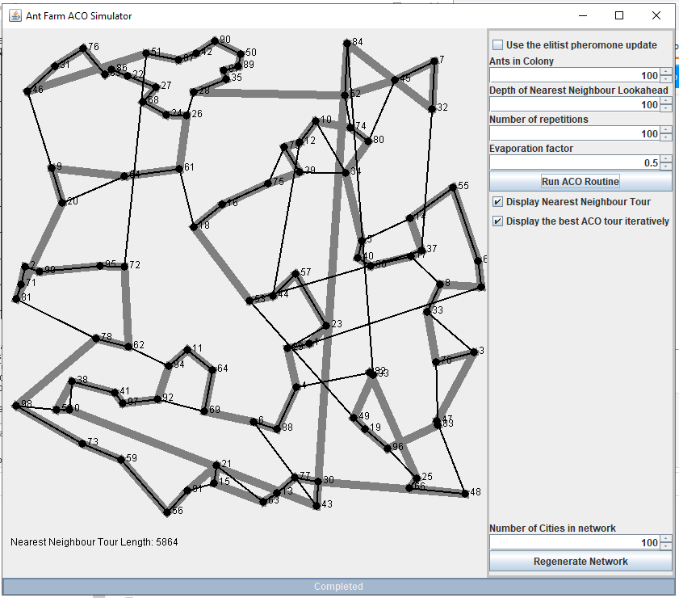
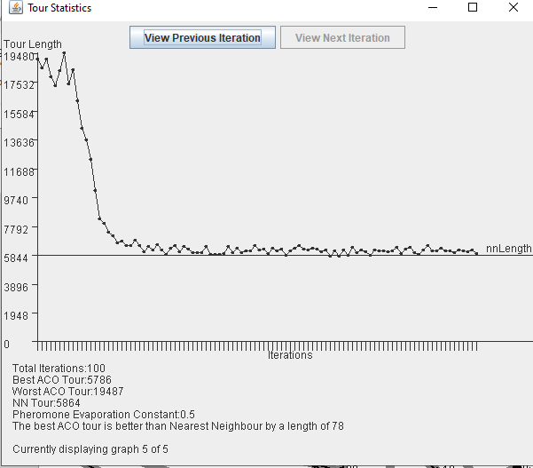

# AntFarm - Ant Colony Optimization Toolkit

Toolkit and demo tool to help in demonstrating Ant Colony Optimisation to students. The algorithm is copied pretty much wholesale from the [ACO book](https://www.amazon.co.uk/Ant-Colony-Optimization-Bradford-Book/dp/0262042193).

## About This

This was the code I wrote my Computer Science dissertation from 2008. Found on an old harddrive and uploaded in 2021 for posterity. Shouldn't be taken seriously unless you're desperately looking for an implementation of ACO in Java with a terrible UI from an undergraduate student in 2008.

## Compiling

Building as a jar file:
```
jar cfm ACO.jar Manifest.txt -C build .
```

### Main Interface

User can set problem space parameters and basic ACO routine parameters in main window. Thick grey lines shown nearest neighbour route, thin black lines show best ACO generated route for current generation.

</img>

### Displaying Results

After ACO routine is run to completion, results are shown as a graph graph of min tour length per iteration and basic statistics about overall routine peformance

</img>

## Thoughts in 2021

* Whilst the code is a mess to look at and the design pretty basic, I'm not as ashamed of it as I thought I'd be. Certain things are obviously bad; theres no separation between the results logic and the ui, and the code is scruffy and badly formatted. However, methods mostly have decent names and nothing is too massive or unweildy. It's beginner code for sure, but i've seen worse code written by professional developers that people have paid real money for.

* Certain design decisions dont make a lot of sense and leave it looking unpolished; the best overall route isn't persisted on the screen and there's no way of exporting routes generated once they're complete. Saving and loading networks would have gone a long way to making this actually useful, as would exporting and exploring routes. I should have done more research into canonical TSP problems and had the ability to load them in.

* As an educational tool it isn't really much use. There arent enough parameters to play around with and there isn't an easy way of comparing runs against one another. Designing this as a generalised tool to demonstrate approaches to solving the travelling salesman problem with a focus on ACO would have been more useful in the long run and probably produced a better design and more usable app.

* Probably I could have focused more on providing a tool allowing for a step by step runthrough of the ACO routine which would at least made the app useful for demonstrating how the routine actually works.

* During my dissertation I paid absolutely no interest in performance or memory usage, to the point that I dont think it was discussed within the dissertation proper. This is not optimised in any meaningful way and it shows.

* I received a 67% for my dissertation, the only comments I seem to remember receiving were around the quality of my graph rendering logic and whether the professor would be able to take the code for his own use - I said yes hoping it would boost my grade.

* I wish I'd been smart enough to detect the approach to optima with something like simulated annealing.

* There is little documentation in the code and none on the interface.Giving the user literally any hint about what the parameters do would have been nice.

* I was, and still am, more interested in the nature inspired aspect of the routine than the theoretical computer science applications. Ants are cool, computers remain dumb.
